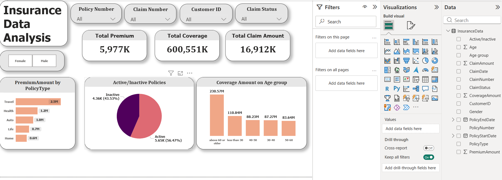
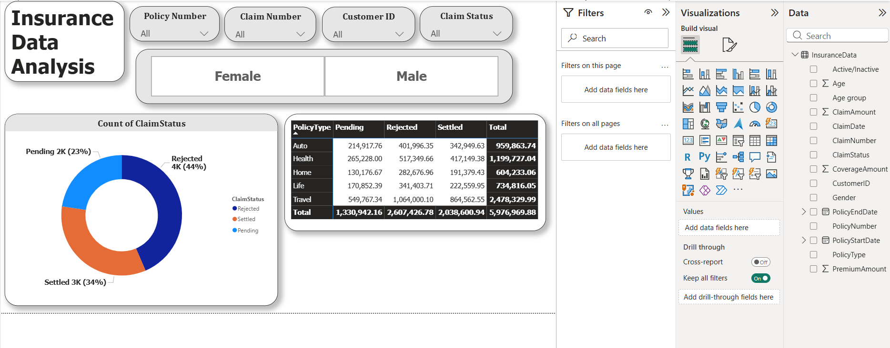

# Insurance Data Analysis – Power BI Dashboard

## Project Overview
This Power BI dashboard analyzes insurance data to understand premium distribution, claim trends, and policy coverage insights.

## Key KPIs
- Total Premium Collected
- Total Coverage Amount
- Total Claims Paid
- Active vs Inactive Policies

## Dashboard Insights
- Premium distribution by policy type
- Claim status analysis (Pending, Rejected, Settled)
- Coverage analysis by age group
- Policy type claim comparison

## Tools Used
- Power BI
- DAX
- Data Modeling
- Data Visualization

## Dashboard Preview

- Coverage analysis by age group
- Policy type claim comparison

## Tools Used
- Power BI
- DAX
- Data Modeling
- Data Visualization

## Dashboard Preview

## Author
Prerna Kale  
Aspiring Data Analyst)

## Author
Prerna Kale  
Aspiring Data Analyst
